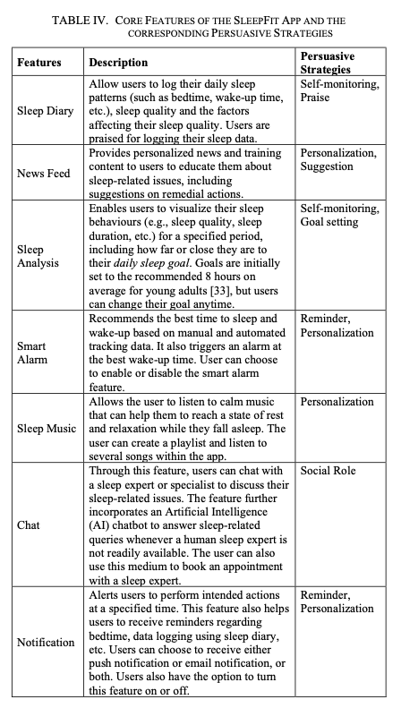

Most research begins with a question. Behaviour change is a research field that I am interested in and I would like to know more about it. I wonder if technology could help people in attaining new behaviours they could benefit from and here's where my research starts. I will be reading everything I can relevant to to the topic and its theoretical framework so to find a purpose for my thesis.

## Notes on behavioural change support system (extracts from from the BCSS wiki page [1])

A behavioural change support system (**BCSS**) is any information and communications technology ICT tool, web platform, or gamified environment which targets behavioural changes in its end-users. BCSS are built upon **persuasive systems design** techniques.

The designs of these systems and their contents are based on behavioural change theories and models for behavioural change over time.

A supporting model is the **Fogg Behaviour Model** (FBM) which states that a user must be motivated before having the ability to perform the change in their behaviour, which is triggered (prompted) by either intinsic or extrinsic factors. BCSS make use of extrinsic (perceptural) prompts like alarms, messages with offers or calls to action, ads, requests, and more.

Other theories that aid in the design and mechanisms behind a BCSS include the **social learning theory** (SLT), which studies the interactions between a user and the environment, and the theory of planned behaviour (initiated as the theory of reasoned action).

Applications of BCSS may include game and training elements in several market domains which can range from Health and Education and Quality of Life (QoL), to professional development and workability.

When users are aware of a BCSS intention - ie. causing a shift in a person's behaviour - and they choose to work within the system, the chances of favourable results from this system increase. This effect is attributed to **metacognition**. Most BCSS systems implement metacognitive strategies for goal attainment. These strategies help users understand the cause of their resistance to adopting the desired behaviour. It requires that they monitor themselves whenever the targeted behaviour can be observed to understand their progress towards the desired behaviour, and record evidence of their behavioural changes.

There can be a positive impact on people by considering behaviours and the distance to the desired behaviour. This can be achieved by helping them develop a **personalised plan** for reaching the target behavior and learning the ways to achieve their personal goals. The general objective can be split into more than one objective or step. The positive feedback introduces **self-management** in BCSS applications since it is particularly helpful for people to **take responsibility** for their own actions and do things to the best of their ability. BCSS is very often equipped with additional features like game elements to foster users engagement leading to **serious game applications**. Moreover, they implement machine learning techniques to **predict the future behaviour** of users based on their past performance. **Visual analytics** tools, such as performance graphs, communicate the evidence of the achieved change in behaviour. Additional tools frequently found in BCSS include checklists and questionnaires to collect users' feedback, IoT devices, and social collaboration to help the members of a user **community to support** each other. Occasionally, some BCSS allow **professionals** (educators, medical personnel and social progessionals) to participate in the BCSS activities. This can be done by giving advice and support and also by making decisions and alterations to the treatment plan.

### Metacognition [from wiki](https://en.wikipedia.org/wiki/Metacognition)

Cognition is the mental action or process of acquiring knowledge and understanding through thought, experience, and the senses. Cognition = cognitive process.

Metacognition is an awereness of one's thought processes and understanding of the patterns behind them. Metacognition can take many forms, such as reflecting on one's ways of thinking and knowing when and how to use particular strategies for problem-solving. There are generally two components of metacognition: (1) knowledge about cognition and (2) regulation of cognition.  For example, a person is engaging in metacognition if they notice that they are having more trouble learning A than B, or if it strikes them that they should double-check C before accepting it as fact. J. H. Flavell (1976, p. 232).

## Notes from Climate Change Needs Behavior Change

On the importance of behaviour change, the report says "By changing how humans around the world consume the products and services that come from natural resources, we can measurably reduce greenhouse gas (GHG) emissions."

From page 33, the report presents a brief overview of behavioural science. Now some Copy&Paste from from that section of the report [3].

### A brief overview of behavioural science
#### Rational choice theory
The rational choice theory contends that behaviour results from individuals acting to maximise the expected benefit of their individual decisions. Individuals make these decisions afterweighing expected benefits and costs and choosing the action or behaviour that offers the highest expected net benefit or lowest expected net cost. 

Theory of Reasoned Action and Theory of Planned Behaviour are behaviour change models that use this framework. 

Much of the criticism for the rational choice model is pointed at the model's core assumptions about individual's access to perfect information, infinite attention that humans can devote to effortful activities, and it does not take into account emotions and factors other than self-interest (eg. moral and social considerations).

The Theory of Planned Behavior introduced a new variable to the Theory of Reasoned Action with perceived behavioral control to encompass the ways that perceived self-efficacy and supportive conditions also affect behavior.

#### Advances in contemporary behavioral science
In 2002, psychologist Daniel Kahneman won the Nobel Prize in Economics for his work with Amos Tversky to develop prospect theory, which describes how people make decisions under uncertainty and how that deviates from what most rational choice, or ‘normative,’ models of rational behavior expect. 

Prospect theory makes it clear that human decisions are not always optimized, because they are influenced by ways in which the decisions are framed.

As popularized in Kahneman’s international best-seller, Thinking, Fast and Slow, the brain’s psychological forces can broadly be thought of as ‘System 1’ and ‘System 2.’ System 1 is fast, intuitive, automatic, and emotional, while System 2 is controlled, deliberative, and analytical. System 1 relies on heuristics or cognitive shortcuts and is also responsible for biases or variability in decision making. Kahneman’s dual-system theoretical framework is one explanation for how judgments do not often follow expected notions of rationality; instead they are often made by the impressionable and emotional System 1, even as System 2 unsuccessfully attempts to monitor this behavior. At the same time, it is worth considering the adaptive nature of our non-rational behavior rather than seeing it as less desirable than rational behavior Through humans’ evolution, we needed to make fast decisions with limited information, and mental shortcuts were essential for our survival.

Thaler’s work and that of other behavioral economists emphasize how people defy economic theory with non-rational yet predictable behaviors. Much of this evidence is reviewed in Thaler and Cass Sunstein’s best-selling book, Nudge: Improving Decisions about Health, Wealth, and Happiness. The experiments discussed in Nudge and Thinking, Fast and Slow consistently show that individuals make decisions not based on perfect information and rational choice but in much more nuanced ways that depend on psychological antecedents, such as values, beliefs, and social norms, and result from routines and habits that do not involve deliberative, cognitive processes.

Late in 2017, new research emerged in favor of an alternative approach for influencing behavior, called “boosts” and explains several key distinctions between nudges and boosts in
theory and practice. While nudges attempt to make the target behavior easier by influencing a person’s environment, boosts also engage directly with human agency (=the ability to take action or to choose what action to take) and cooperation by building competence, skills, and knowledge in the decision-making process.

### Models of behaviour change
The behavioral science revolution has brought forward a range of models and heuristics to explain how behavior change occurs.

Below we highlight several archetypes that appear in most mainstream behavior change models.

#### Education models
It proposes that education will lead to awareness and attitude change, which will create behavior change.

#### Extrinsic motivation models
As expressed through today’s “carrot or stick” approach, external motivation suggests that human behavior can be influenced through providing incentives and/or punishments. While it remains a common approach today, researchers have shown that external motivation’s primary weakness is that is rarely leads to long-lasting behavior and requires continual or larger interventions to maintain the same outcomes.

#### Intrinsic motivation models
Building competence, autonomy or self-efficacy, and a sense of connectedness are self-motivated and can be leveraged in the behavior change process.

#### Information-processing based models
These models suggest that there are fundamental informational needs of humans at the core of motivation and action.

Supportive environments = Increase Attitudes/knowledge + Increase Ability + Meaningfulness => Behaviour change

#### Social models
Social models draw mostly on sociological theories and
differ from individualist theories by putting much more emphasis on the context and structures that interact with and determine the ways in which individuals behave. They focus more specifically on actions rather than actors and seek to understand how differing social and infrastructural contexts might make these actions inevitable.

### Assessing the effectiveness of behavioural interventions

For any behavior change model and intervention strategy, we should examine its overall effectiveness and applicability . De Young (1993) provides a useful set of evaluation metrics that we can use for this purpose:

- Speed of change: how quickly a behavior is adopted during an intervention

- Reliability: whether behavior changes the first time during an intervention and in subsequent
interventions over time

- Particularism: the level of specificity or tailoring of an intervention to subgroups as opposed to a universal application

- Generalizability: whether an intervention causes someone to become a change-agent for that behavior and/or adopt non-target behaviors through a “spill over” effect

- Durability: whether a behavior is maintained without continual intervention and is adopted as a common practice

Additional metrics include considering an individual’s attentional state, emotional state, and sense of meaningfulness that result from an intervention .

### Conclusions

Human behavior and decision-making are complex. While our understanding of this complexity has evolved from purist ‘rational choice’ models of human behavior to much more nuanced theories of behavior that capture psychological and sociological insights, there are still many questions that remain about the most effective and sustainable approaches to behavior change, especially if we are to change ingrained patterns of natural resource consumption that are so central to developed, consumption-driven economies. The recent trend of applying innovative research in behavioral science to public challenges has highlighted how powerful psychological tendencies can be directed toward behavior that provides social and planetary benefit. 

## Notes from "Persuasive System Design: State of the Art and Future Directions"
Copy&Paste from from paper [2].

At least four key computer-based fields of research for persuasive systems and design can be recognised: human-computer interaction, computer-mediated communication, information systems, and affective computing. We should observe two key disciplines from the humane sciences namely psychology and rhetoric, as they address core aspects of human persuasion and the cognitive traits that apply within the area.

We must also note that none of the disciplines mentioned above on their own encapsulate technology-mediated persuasion; rather they seem to touch upon some aspect of it. What distinguishes persuasive systems from other systems is that persuasive systems are inherently transformative. Persuasive systems deliberately attempt to infuse a cognitive and/or an emotional change in the mental state of a user to tranform the user's current cognitive state into another planned state. The focus of any persuasive system must be a tech-mediated transformation of either attitudes or behaviours, including a transformation by bolstering or reinforcing existing attitudes or behaviours.

The paper continues outlining the Persuasive System Design (PSD) model and findings about the literature review.

The Persuasive Systems Design model (PSD model)[5] could be useful for the collection of software requirements and design of persuasive systems. The model provides a recent and extensive conceptualization of technology-mediated persuasion. The model was originally created to prescribe persuasive designs and software requirements. 

The model describes four dimensions. Each of these addresses an aspect of technology-mediated persuasion. These are relatively well-known persuasive elements that may be employed for persuasive system design. The dimensions are primary task support, dialogue support, system credibility support, and social support; they are described in more detail in the [12].

**Primary task support**: This dimension addresses the target behaviors. For this dimension seven categories are employed: reduction (P1, P to denote principle), tunneling (P2), tailoring (P3), personalization (P4), self-monitoring (P5), simulation (P6), and rehearsal (P7). In the analysis, it was noted which types of primary task support the research work mainly employed, if any, and whether a paper employed more than one design principle.

**Dialogue support**: This dimension deals with the feedback that the system offers in guiding the user to reach the intended behavior. This dimension also employs seven design principles for providing dialogue support: praise (P8), rewards (P9), reminders (P10), suggestion (P11), similarity (P12), liking (P13), and social role (P14).

**System credibility support**: In general, credibility (or ethos) is a persuasive element. The PSD model operates with seven design principles for supporting system credibility: trustworthiness (P15), expertise (P16), surface credibility (P17), real world feel (P18), authority (P19), third party endorsements (P20), and verifiability (P21).

**Social support**: Social support is another greater category that affects the overall persuasiveness of a software system. The model operates with seven design principles for providing social support: social learning (P22), social comparison (P23), normative influence (P24), social facilitation (P25), cooperation (P26), compensation (P27), and recognition (P28).

Appendix 1 devises a heuristic that could serve as a starting point when embraking in dissemination work. 

The paper is from 2009 so I should check if it has been superseeded.

## Society for Persuasion and Technology [4]
**Definition:** Persuasive Technology is defined as technology that is designed to change attitudes or behaviours of the users through persuasion and social influence, not through coercion or deception. It includes persuasive communication pertaining to attitude and behaviour change systems, attitude and behaviour change through technology, related to issues relevant to individuals, to public- and private-sector organisations, and to society at a local, regional, national, or global level.

## Notes from The Race Towards Digital Wellbeing: Issues and Opportunities (de russis & monge - Politecnico)
The paper analyses the current android app market to look for mobile apps that help users to break "smartphone addictions" and achieve "digital wellbeing". This research wants to find out the features available in mobile apps and how effective they are. They find out that those mobile apps are very appreciated by the users and the main "issue" with them is that they don't help users in building new healthy habits regarding using their smartphones.
The main suggestions made by the authors are:
1. Users might want/need more restrictive solutions to limit their excessive use of smartphones. 
2. Apps should adopt tools and methodologies to support habits formation and make healthy habits persistent, eg. by increase the usage of positive reinforcement techniques, by providing cues and trigger events, social supporting techniques, interaction with other users, social games. They claim that digital wellbeing apps should be more grounded in the social cognitive theory.

  ---> From the apps'reviews, it seems clear that different users are motivated by different things: some people like seeing data more while for others is essential to have leaderboards to understand how they are doing compared to other users. 

   ---> Why don't certain habits require much "external" motivation? What I am trying to say comes from the observation that certain habits like walking or cycling are self-motivating. For this kind of habits, it's usually enough to offer data visualisation, metrics, and leaderboard to keep the user on track with habit formation.

  ---> breaking habits != new habits formation. Many apps focus on breaking habits, eg. reduce screen time, but they don't help with replaceing the bad habits.

## Notes from Persuasive Systems Design: Key Issues, Process Model, and System Features
In **computer-human** persuasion the persuader is not the computer ofc but the people who create, distribute, or adopt the technology.

**Computer-mediated** persuasion means that people are persuading others though computers, eg. discussion forums, e-mail, instant messages, blogs, or social networks.

## Notes from SleepFit: A Persuasive Mobile App for Improving Sleep Habits in Young Adults

Wellness app developed using user-centered design approach and described using the PSD model and language.

Table with core features from [6].

## Random

"Although not sufficient, education is a necessary component for behaviour change", cit. Arlinghaus and Johnston. BCSSes are used in education less for imparting knowledge and more for teaching a difficult subject or for changing attitudes and beliefs about a topic of interest.

Recognising the blocking issue is key to be able to change behaviour.

## Sleep apps

Search terms on google play: sleepfit. Selected some random apps that looked interesting to me.

- [Sleep Routine](https://play.google.com/store/apps/details?id=ai.asleep.android_aaron)

- [Sleep Time](https://play.google.com/store/apps/details?id=ru.olegfilimonov.sleeptime)

- [Tide - Sleep & Meditation](https://play.google.com/store/apps/details?id=io.moreless.tide&hl=it)

## Books

- [Why We Sleep: The New Science of Sleep and Dreams, Matthew Walker, 2017](https://en.wikipedia.org/wiki/Why_We_Sleep)

- [How to Change: The Science of Getting from Where You Are to Where You Want to Be, Katy Milkman, 2021](https://www.goodreads.com/en/book/show/55655032)

## References 

[1] https://en.wikipedia.org/wiki/Behavioral_change_support_system

[2] Persuasive System Design: State of the Art and Future Directions, Torning, Kristian and Oinas-Kukkonen, Harri, https://dl.acm.org/doi/10.1145/1541948.1541989

[3] Climate Change Needs Behavior Change report 2018, https://rare.org/report/climate-change-needs-behavior-change/

[4] [Society for Persuasion and Technology](https://persuasivetech.org/)

[5] https://www.researchgate.net/publication/257411281_Persuasive_Systems_Design_Key_Issues_Process_Model_and_System_Features

[6] https://www.researchgate.net/publication/353163463_SleepFit_A_Persuasive_Mobile_App_for_Improving_Sleep_Habits_in_Young_Adults

## Other papers I have read or skimmed
- Not (B)interested? Using Persuasive Technology to Promote Sustainable Household Recycling Behavior

- A Review of the Use of Persuasive Technologies to Influence Sustainable Behaviour

- Designing for App Usage Motivation to Support a Gluten-Free Diet by Comparing Various Persuasive Feedback Elements

- HeartHealth: A Persuasive Mobile App for Mitigating the Risk of Ischemic Heart Disease
